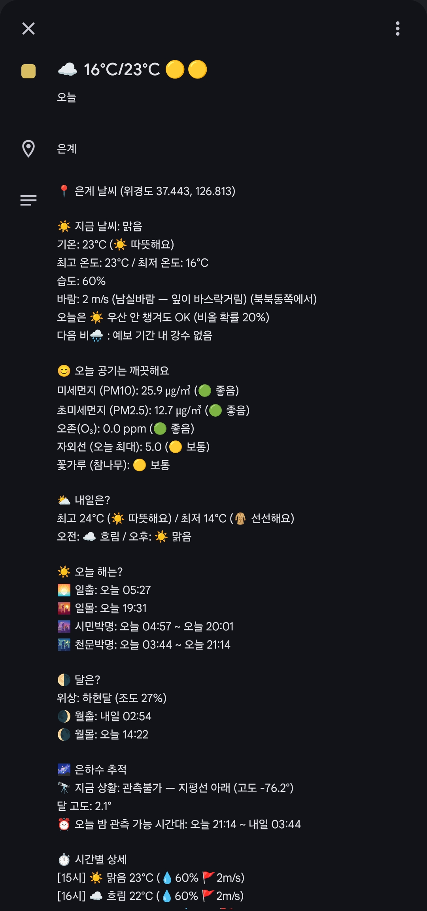

# ☀️ KMA Weather Calendar

[](https://github.com/redchupa/weather-calendar/actions/workflows/update.yml)
[](LICENSE)
[](https://redchupa.github.io/weather-calendar/)
[](#-sponsor)

🌐 **Language**: **English** · [한국어](README.md)

> **🌟 Set up in 5 minutes — get daily Korea weather pushed straight to your phone calendar, automatically.**

This project pulls weather forecasts from the Korea Meteorological Administration (KMA) API, generates an iCalendar (`.ics`) file containing **today through 10 days of forecasts**, and refreshes it on a GitHub Actions schedule. Subscribe the URL once in Google / Apple / Samsung Calendar and you're done — no widget, no extra app, just one URL.

<p align="center">
  
  &nbsp;&nbsp;
  
  <br>
  <em>📱 Actual Samsung Galaxy / Google Calendar view — weather emoji + min/max temp in each date cell</em>
</p>

---

## 💚 Worried it's too technical?

**No coding required.** If you can click a mouse and copy/paste, you can do this.

| | |
|---|---|
| ⏱ **Estimated time** | ~15-30 min for first-timers (KMA approvals can add 1~2 days) |
| 💰 **Cost** | **Completely free** (both APIs and GitHub free plan, forever) |
| 🛠 **What you need** | A GitHub account, an email, and a Korean phone (for KMA verification) |
| 🆘 **Stuck?** | Each step lists common gotchas. Open an [Issue](https://github.com/redchupa/weather-calendar/issues) if needed. |
| 💡 **Trickiest parts** | Registering 9 secrets correctly + mobile sync. Both covered in detail. |

---

## 🚀 Step-by-step setup

> 💡 A more visual walkthrough (with a built-in coordinate/region calculator) is at the **[📖 GitHub Pages guide](https://redchupa.github.io/weather-calendar/)**.

### 1️⃣ Fork this repo to your account

1. Click **[Fork]** in the top-right of this page
2. Click "Create fork" — a copy lands in your account
3. All subsequent steps happen **in your forked repo** (not the original)

### 2️⃣ Get API auth keys (from TWO providers)

> 📌 **This project uses two separate API providers. Both are free, but you need to issue keys at each one.**
> - **A. KMA API Hub** → weather / warnings / earthquakes / typhoons (`KMA_API_KEY`)
> - **B. data.go.kr (Public Data Portal)** → air quality / UV / pollen (`DATA_GO_KR_KEY`)
>
> 🚨 **Common gotcha**: If you click [활용신청] and **no "신청 완료" confirmation appears**, refresh the page (F5) and click [활용신청] again. The first request occasionally fails silently. Applies to both sites.

---

#### 🅰 Get `KMA_API_KEY` at KMA API Hub

1. Sign up at [KMA API Hub](https://apihub.kma.go.kr/) (email + phone verification only — no Korean citizen certificate needed)
2. In the left menu, apply for each of these **7 services** ("활용신청" button):
   - **예특보 (Forecasts/Warnings)** > 단기예보 › `4.2 초단기예보조회` (ultra-short, for accuracy boost)
   - **예특보** > 단기예보 › `4.3 단기예보조회` (short-term)
   - **예특보** > 중기예보 › `2.2 중기기온조회` (mid-term temperature)
   - **예특보** > 중기예보 › `2.3 중기육상예보조회` (mid-term land)
   - **예특보** > 기상특보 › `2. 특보현황 조회` (`wrn_now_data_new.php`)
   - **지진/화산** > 국내·외 지진정보 › `2. 지진목록 조회` (`eqk_list.php`)
   - **태풍** > 태풍정보 › `1.3 태풍정보+예측(시점기준)` (`typ_now.php`)
3. Top right **[마이페이지] → [인증키 현황]** — copy the API key string

> ℹ️ Approvals are usually instant, occasionally a few minutes.

---

#### 🅱 Get `DATA_GO_KR_KEY` at data.go.kr

1. Sign up at [data.go.kr](https://www.data.go.kr/)
2. Search the portal for these **3 APIs** and click **[활용신청]** on each:

   | Search keyword | API name | Purpose |
   |---|---|---|
   | `에어코리아 대기오염정보` | AirKorea Air Pollution Info | 🌫️ PM10·PM2.5·O3 realtime + forecast |
   | `생활기상지수` | KMA Living Weather Index Service | ☀️ UV / food poisoning / asthma indices |
   | `꽃가루` | KMA Health Weather Index Service (pollen) | 🌸 Oak · pine · weeds pollen |

3. After 1~2 days, copy the **encoded general auth key** from [data.go.kr My Page → Auth keys](https://www.data.go.kr/iim/api/selectAcountList.do)

> 💡 **A single general auth key works for all 3 APIs.** You apply separately per API, but the key is shared.
>
> 💡 The pollen API is found by searching `꽃가루` (not `보건기상지수`).

### 3️⃣ Find your neighborhood's NX/NY + region codes

KMA encodes neighborhoods as a grid (NX, NY) and uses separate codes (like `11B10101`) for mid-term forecasts.

Easiest path: use the **[📖 GitHub Pages guide](https://redchupa.github.io/weather-calendar/)** Step 3 calculator:
- Pick the nearest forecast station from the dropdown
- Type your road-name address
- **NX, NY, REG_ID_TEMP, REG_ID_LAND, DATA_GO_KR_REGION** are all auto-computed

Save those values.

### 4️⃣ Add GitHub Secrets (9 total)

> 📌 **You need API keys from TWO separate providers**:
> 1. **[KMA API Hub](https://apihub.kma.go.kr/)** → `KMA_API_KEY` (issued in Step 2)
> 2. **[data.go.kr](https://www.data.go.kr/iim/api/selectAcountList.do)** → `DATA_GO_KR_KEY` (general auth key from My Page)
>
> These are **separate keys, not interchangeable**. Both are free.

In your forked repo:
- **Settings** tab
- Left menu **Secrets and variables → Actions**
- Green **[New repository secret]** button
- Register all 9 secrets below one at a time (Name + Secret value → "Add secret")

**Required secrets (9)**

| Name | Value | Where to get |
|---|---|---|
| `KMA_API_KEY` | KMA auth key | Step 2 |
| `KMA_NX` | Forecast grid X (e.g., `60`) | Step 3 |
| `KMA_NY` | Forecast grid Y (e.g., `127`) | Step 3 |
| `REG_ID_TEMP` | Mid-term temperature zone code (e.g., `11B10101`) | Step 3 |
| `REG_ID_LAND` | Mid-term land zone code (e.g., `11B00000`) | Step 3 |
| `LOCATION_NAME` | Neighborhood label shown on events (e.g., `My Home`) | Pick anything |
| `DATA_GO_KR_KEY` | data.go.kr general auth key (for 🌫️ PM / ☀️ UV / 🌸 pollen) | [data.go.kr](https://www.data.go.kr/), apply for 3 APIs below |
| `DATA_GO_KR_REGION` | AirKorea forecast region name | One of 19 region names |
| `LIVING_AREA_NO` | 10-digit administrative code (for ☀️ UV · 🌸 pollen) | [code.go.kr 법정동코드 검색](https://www.code.go.kr/stdcode/regCodeL.do) — pick the city-level code (ends in `000000`). See lookup table below. |

> ⚠️ Secret names are **case-sensitive** — one typo and the workflow gets an empty value and fails.
>
> 💡 **`DATA_GO_KR_REGION` valid values (AirKorea naming)**: `서울` (Seoul), `부산` (Busan), `대구` (Daegu), `인천` (Incheon), `광주` (Gwangju), `대전` (Daejeon), `울산` (Ulsan), `세종` (Sejong), `경기북부` (N. Gyeonggi), `경기남부` (S. Gyeonggi), `강원영서` (W. Gangwon), `강원영동` (E. Gangwon), `충북` (N. Chungcheong), `충남` (S. Chungcheong), `전북` (N. Jeolla), `전남` (S. Jeolla), `경북` (N. Gyeongsang), `경남` (S. Gyeongsang), `제주` (Jeju)

<details>
<summary><b>📋 Common Korean district codes (click to expand)</b></summary>

**Metro & Provinces (provincial level):**

| Region | Code |
|---|---|
| Seoul | `1100000000` |
| Busan | `2600000000` |
| Daegu | `2700000000` |
| Incheon | `2800000000` |
| Gwangju | `2900000000` |
| Daejeon | `3000000000` |
| Ulsan | `3100000000` |
| Sejong | `3600000000` |
| Gangwon | `4200000000` |
| N. Chungcheong | `4300000000` |
| S. Chungcheong | `4400000000` |
| N. Jeolla | `5200000000` |
| S. Jeolla | `4600000000` |
| N. Gyeongsang | `4700000000` |
| S. Gyeongsang | `4800000000` |
| Jeju | `5000000000` |

**Major Gyeonggi cities:**

| City | Code |
|---|---|
| Suwon | `4111000000` |
| Seongnam | `4113000000` |
| Uijeongbu | `4115000000` |
| Anyang | `4117000000` |
| Pyeongtaek | `4122000000` |
| Ansan | `4127000000` |
| Goyang | `4128000000` |
| Siheung | `4139000000` |
| Hwaseong | `4159000000` |

**Major Seoul districts:**

| District | Code |
|---|---|
| Jongno-gu | `1111000000` |
| Gangnam-gu | `1168000000` |
| Songpa-gu | `1171000000` |
| Mapo-gu | `1144000000` |
| Yeongdeungpo-gu | `1156000000` |
| Gangseo-gu | `1150000000` |

> For other regions, search at [code.go.kr legal district code lookup](https://www.code.go.kr/stdcode/regCodeL.do).

</details>

### 5️⃣ Enable workflow & run

1. **[Actions]** tab
2. If freshly forked, click **"I understand my workflows, go ahead and enable them"** (one-time)
3. Left list: **`Update Weather ICS`**
4. Top right: **[Run workflow]** dropdown → green **[Run workflow]** button
5. Wait 30s~1min for the green checkmark
6. Your repo's **`weather.ics`** should be freshly updated

> ❌ Red X? 99% of the time it's a missing/mistyped secret. Re-check all 9.

### 6️⃣ Subscribe in your calendar app

**(a) Copy the ICS raw URL**
1. Click `weather.ics` in your repo
2. Top right **[Raw]** button
3. Copy the URL — format:
   `https://raw.githubusercontent.com/<your-id>/weather-calendar/main/weather.ics`

**(b) Google Calendar (PC web — recommended)**
1. [calendar.google.com](https://calendar.google.com)
2. Left "Other calendars" → **`+`** button
3. **"From URL"**
4. Paste raw URL → **[Add calendar]**

> 📱 Samsung Galaxy: Samsung Calendar doesn't support ICS URL subscription directly. Best path: add to **Google Calendar on PC** first → it syncs to your Android Google Calendar app.

**(c) iPhone / Mac (Apple Calendar)**
1. iPhone: **Settings → Calendar → Accounts → Add Account → Other → Add Subscribed Calendar**
2. Server: paste raw URL → Next → Save

### 7️⃣ 📱 Not showing on mobile? (Critical)

> Visible on PC Google Calendar but missing on phone? Very common. Google doesn't automatically include URL-subscribed calendars in mobile sync.
>
> ❗ Do **A → B → C in order**. Just doing A and waiting won't work.

#### A. Check "Sync Select" page (browser)

1. Browser → **https://calendar.google.com/calendar/syncselect**
2. While signed into your Google account, check the box for your weather calendar
3. **[Save]**

> This is the **master switch** for mobile sync. Without this checked, B/C are pointless.

#### B. Enable sync in mobile Google Calendar app

After A, the calendar doesn't auto-appear on your phone. You must manually enable sync:

1. Open Google Calendar app
2. ☰ menu top-left → **Settings**
3. Under your Google account, tap your weather calendar
4. Toggle **"Sync" ON**
5. Go back

> If the calendar name isn't in the settings list, A failed or wasn't saved. Re-check A.

#### C. Toggle "visible" (checkbox) in the app

Sync ON doesn't mean visible. Calendar appears with a grey checkbox — **tap to fill it** to make events display:

1. ☰ menu again
2. In calendar list, tap the checkbox next to your weather calendar → **filled color**
3. Close menu and verify events appear in month/week view

Done! 🎉

#### Other environments

| Environment | How |
|---|---|
| **Samsung Galaxy — native Samsung Calendar** | ⚠️ Samsung Calendar can't display subscribed calendars. Install **Google Calendar app** and follow A→B→C. |
| **iPhone — recommended** | Skip Google entirely. Subscribe directly in Apple Calendar: Settings → Calendar → Accounts → Add Account → Other → Add Subscribed Calendar → paste raw URL |
| **iPhone — via Google** | Install Google Calendar iOS app, then follow A→B→C. iPhone's native Calendar app won't show it (CalDAV doesn't sync subscribed calendars). |

#### Still not showing?

| # | Check |
|---|---|
| 1 | Visible on PC Google Calendar? If not, the subscription itself failed |
| 2 | https://calendar.google.com/calendar/syncselect — checked? (A) |
| 3 | Mobile app Settings → your calendar → "Sync" toggle ON? (B) |
| 4 | Left menu calendar list checkbox filled? (C) |
| 5 | Force-quit and reopen the mobile app |
| 6 | Wait up to 24h. Still nothing → delete subscription and re-add |

---

## ❓ FAQ

<details>
<summary><b>Q. First run failed (red X)</b></summary>

99% of the time it's a secret problem. Check:
- All 9 secrets registered (`Settings → Secrets and variables → Actions`)
- **Exact spelling/case** (e.g., `KMA_API_KEY` ≠ `kma_api_key`)
- No leading/trailing whitespace in `KMA_API_KEY` or `DATA_GO_KR_KEY`

After fixing, re-run from the Actions tab.
</details>

<details>
<summary><b>Q. Subscribed to the calendar but no weather is showing</b></summary>

Checklist:
1. Did the workflow actually succeed? Check the green check in the Actions tab
2. Does your `weather.ics` file actually have data?
3. **Visible on PC but not mobile?** → See **[7️⃣ Not showing on mobile](#7️⃣--not-showing-on-mobile-critical)** (Google Sync Select is the most common cause)
4. Calendar app refresh cycle — Google Calendar refreshes subscribed URLs **every 8~24h**
</details>

<details>
<summary><b>Q. Added a new feature but my calendar isn't picking it up quickly</b></summary>

**Google has its own cache server** between your raw URL and your subscribed calendar. Even after delete + re-subscribe, Google may return cached data.

**Workaround** — re-subscribe with a cache-busting query parameter:
```
https://raw.githubusercontent.com/<your-id>/weather-calendar/main/weather.ics?v=2
```
- Next time it sticks, try `?v=3`, `?v=4`, etc.
- This makes Google treat it as a fresh URL and re-fetch.

**Alternatives**:
- One-time import: download the .ics file → Google Calendar → Settings → Import
- Subscribe directly in Apple Calendar (no Google cache, configurable refresh)
- Just wait 8~24h (natural cache expiration)
</details>

<details>
<summary><b>Q. UV / pollen show HTTP 403 in logs</b></summary>

`DATA_GO_KR_KEY` is a single auth key but **each API needs separate activation** on data.go.kr. Verify all 3 of these are **approved** in My Page → 활용신청 현황:
- 한국환경공단_에어코리아_대기오염정보
- 기상청_생활기상지수 조회서비스(3.0)
- 기상청_꽃가루농도위험지수 조회서비스(3.0)

Note: pollen is found by searching `꽃가루` (not `보건기상지수`).
</details>

<details>
<summary><b>Q. "Node.js 20 is deprecated" warning</b></summary>

**Ignore it.** The workflow has `FORCE_JAVASCRIPT_ACTIONS_TO_NODE24: true` set, telling GitHub to force-run these actions on Node 24. The warning is just GitHub informing you of the forced upgrade. Result: still a success.
</details>

<details>
<summary><b>Q. What's the "make public" option when adding a calendar?</b></summary>

That's a Google Calendar setting that asks whether **your copy** of the calendar is publicly viewable. It's unrelated to the GitHub ICS source. **For personal use on your own phone, leave it off (default).** Only enable if sharing with family/team or embedding in a blog.
</details>

<details>
<summary><b>Q. How often does data refresh?</b></summary>

- **KMA source**: Short-term every 3h, mid-term twice daily (06:00 / 18:00)
- **This repo's weather.ics**: Every 3h KST (02·05·08·11·14·17·20·23) automatically. No action needed after first Actions enable.
- **Calendar app reflection**: Both Google and Apple cache subscribed URLs 8~24h (not user-controllable)
</details>

---

## ⏰ Auto-update schedule

By default [.github/workflows/update.yml](.github/workflows/update.yml) has `schedule:` enabled, running on KST:

| Time | 02:15 | 05:15 | 08:15 | 11:15 | 14:15 | 17:15 | 20:15 | 23:15 |
|---|---|---|---|---|---|---|---|---|

Aligned with KMA's short-term forecast release schedule (every 3h).

```yaml
on:
  schedule:
    - cron: '15 17,20,23,2,5,8,11,14 * * *'   # every 3h KST
```

> 💡 To disable, comment out those two lines with `#`.
>
> ⚠️ Subscribed calendar clients still cache 8~24h. Source updating every 3h doesn't mean client refresh is that fast.

---

## ✨ What information goes in?

### 📅 Forecast data
- 🌤️ **Short-term D+0~3** hourly detail / **Mid-term D+4~10** daily summary — 11 days total
- ⚡ **Ultra-short forecast (0~6h)** auto-merged for near-term accuracy boost
- 🚨 **Weather warnings auto-linked** — 10 types (heatwave, heavy rain, cold wave, typhoon, etc.) as separate events

### 🌫 Air quality & health
- 🌫️ **PM10 · PM2.5 · Ozone** realtime measurements + daily forecast (via AirKorea)
- ☀️ **UV index** (today's max) + 5-tier grading
- 🌸 **Pollen risk** for oak, pine, weeds — integrated max risk

### 🌌 Astronomy
- 🌅 **Sunrise · sunset + civil · astronomical twilight** (great for outdoor planning, photography)
- 🌘 **Moon phase · illumination + moonrise · moonset** (8 Korean phase names)
- 🌌 **Milky Way galactic center altitude + best viewing window** (for stargazers)

### 💥 Disaster alerts
- 🌋 **Earthquakes (M ≥ 3.0)** — domestic vs. overseas labeled, auto-event on detection
- 🌀 **Active typhoons** — Korean impact flagged, includes forecast track at 6 timestamps

### 🎨 Friendly natural-language output
- Comfort messages ("😊 pleasant" / "🥵 very hot" — 7 tiers)
- Beaufort wind grade ("leaves rustle" / "large branches sway" — 12 tiers, in Korean)
- 16-point wind direction ("from the northeast") + umbrella suggestion
- Next-rain prediction, year-over-yesterday comparison

### 🔧 Operations
- 📱 Works with **any calendar app that supports ICS URL subscription** — Google, Apple, Samsung, Naver, etc.
- 🏠 Works for **any neighborhood in Korea** — just need grid coordinates (NX/NY) + region codes
- 🆓 All APIs are free + GitHub Free plan = **fully free to operate**

---

## 📅 Sample ICS event data

**Today's event** (rich info you see when you tap the event in your calendar):

```
SUMMARY: ☁️ 16°C/23°C 🟡🟡        ← Short summary shown in the date cell

DESCRIPTION:
📍 Eungye Weather (37.443, 126.813)

⛅ Now: Mostly cloudy
Temp: 21°C (😊 Pleasant)
High: 23°C / Low: 16°C
Humidity: 65%
Wind: 2 m/s (light breeze — leaves rustling) (from NW)
Morning: ⛅ Cloudy / Afternoon: ☀️ Clear
Today: 🌂 Bring an umbrella to be safe (30% chance of rain)
Next rain🌧 : No rain in forecast window
vs. Yesterday: Today's high is 1° warmer

😊 Air is clean today
PM10: 25.9 μg/m³ (🟢 Good)
PM2.5: 12.7 μg/m³ (🟢 Good)
Ozone (O₃): 0.0 ppm (🟢 Good)
UV (today's max): 5.0 (🟡 Moderate)
Pollen (oak): 🟡 Moderate

⛅ Tomorrow?
High 24°C (☀️ Warm) / Low 14°C (🧥 Cool)
Morning: ☁️ Cloudy / Afternoon: ☀️ Clear

☀️ Today's sun
🌅 Sunrise: today 05:27
🌇 Sunset: today 19:31
🌆 Civil twilight: today 04:57 ~ 20:01
🌃 Astronomical twilight: today 03:44 ~ 21:14

🌗 The moon
Phase: Waning Gibbous (illumination 27%)
🌒 Moonrise: tomorrow 02:54
🌘 Moonset: today 14:22

🌌 Milky Way tracking
🔭 Status: Not visible — below horizon (altitude -76.2°)
Moon altitude: 2.1°
⏰ Tonight's best viewing window: today 21:14 ~ tomorrow 03:44

⏱ Hourly detail
[15:00] ☀️ Clear 23°C (💧60% 🚩2m/s)
...

📊 Last updated: 2026-05-12 14:07:58 (KST)
```

**Other events**:
- **D+1 ~ D+3 (short-term)**: Hourly detail (temp/sky/precip prob/humidity/wind) + air-quality grade
- **D+4 ~ D+10 (mid-term)**: AM/PM or full-day summary + precip prob + min/max
- **Weather warnings** (only when active): `🚨 Heatwave Warning (Seoul)` as separate event
- **Earthquakes** (M ≥ 3.0 within 7 days): `🌋 Domestic Quake M3.2 (Gyeongju)` as separate event
- **Typhoons** (when active): `🌀 Typhoon KHANUN 28m/s (Korean Impact)` + forecast track of 6 timestamps

---

## 🗺️ Architecture overview

```
[KMA API + data.go.kr] ──fetch──> [GitHub Actions: update_calendar.py]
                                              │
                                              ▼
                                      [weather.ics generated]
                                              │
                                      ──── commit/push ───→ GitHub repo
                                                                 │
                                                        Raw URL  │
                                                                 ▼
                                          [Your phone's calendar app subscribes to URL]
```

After one-time setup, **the workflow regenerates ICS → your calendar app syncs** — fully hands-off.

---

## 🛠 Tech stack

**Python 3.12** + libraries:
- `requests`, `pytz`, `icalendar` — KMA / data.go.kr REST calls + ICS generation
- `astral` — sunrise/sunset/twilight + moon phase
- `ephem` — Galactic center altitude, precise moonrise/moonset

**API integrations (7)**:
- KMA API Hub (apihub.kma.go.kr)
  - Short-term + ultra-short forecast (`VilageFcstInfoService_2.0`)
  - Mid-term forecast (`MidFcstInfoService`)
  - Weather warnings (`wrn_now_data_new.php`)
  - Earthquake list (`eqk_list.php`)
  - Typhoon info + forecast (`typ_now.php`)
- data.go.kr (apis.data.go.kr)
  - AirKorea air pollution (realtime + daily forecast)
  - Living Weather Index V5 — `getUVIdxV5` (UV)
  - Health Weather Index V3 — oak / pine / weeds pollen

**Infrastructure**:
- GitHub Actions — cron (every 3h KST) / `repository_dispatch` / `workflow_dispatch`
- GitHub Pages — setup guide with automatic coordinate/region calculator

## 📂 File structure

```
.
├── update_calendar.py        # Main script: KMA + data.go.kr → rich ICS
├── requirements.txt          # Python dependencies
├── weather.ics               # Generated calendar (raw URL subscription target)
├── .github/workflows/
│   └── update.yml            # Workflow (runs every 3h)
├── .gitignore
├── LICENSE                   # MIT
└── docs/                     # GitHub Pages setup guide
    ├── index.html            # Step-by-step guide + auto-calculator
    ├── region_codes.json     # Mid-term forecast station list
    ├── calendar.png          # Mobile calendar example
    ├── preview-mobile.png    # README hero image
    └── secret-example.png    # GitHub Secrets form example
```

## ☕ Sponsor

If this project helps you, buy me a coffee! 🙏

<table>
  <tr>
    <td align="center">
      <b>Toss</b><br/>
      
    </td>
    <td align="center">
      <b>PayPal</b><br/>
      
    </td>
  </tr>
</table>

---

## 📜 License

[MIT License](LICENSE) © 2026 redchupa

---

> **🙏 Original Author**
> Based on [Murianwind/weather-calendar](https://github.com/Murianwind/weather-calendar) by [**@Murianwind**](https://github.com/Murianwind). Thanks to the original author.
